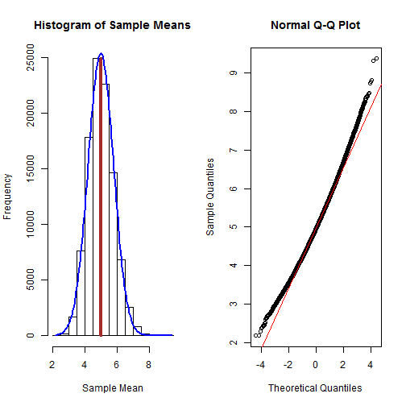

##"Simulation of Exponential Distribution"

```r
library(matrixStats)
#Theoritical Distribution
lambda = 0.2; meanexp = 1/lambda; varexp = 1/lambda^2
#Simulation
#Set seed, sample size of each sample and set the number of samples
set.seed(123); n = 40; N = 100000
#create a dataset of N columns and n rows
data = replicate (N, rexp(n, 0.2))
#calculate mean of each of samples
samplemeans = colMeans(data); datamean = mean(samplemeans); smean <- mean(samplemeans); ssd <- sd(samplemeans)
```
###1. Show where the distribution is centered at and compare it to the theoretical center of the distribution.

```r
print(paste("Distribution mean is close to the Theoritical mean with ", "Distribution mean = ", round(smean,3), " and Theoritical mean = ", round(meanexp,3)))
```

```
## [1] "Distribution mean is close to the Theoritical mean with  Distribution mean =  4.997  and Theoritical mean =  5"
```
###2. Show how variable it is and compare it to the theoretical variance of the distribution.

```r
samplevar = colVars(data); estimatevar = mean(samplevar)
print(paste("Theoritical variance = ", round (varexp,3), " and Estimate of variance = ", round(estimatevar,3)))
```

```
## [1] "Theoritical variance =  25  and Estimate of variance =  24.944"
```
###3. Show that the distribution is approximately normal.

```r
#plot the histogram of the means of samples
shist <- hist(samplemeans)
```

```r
#plot the normal on top of histogram. Ref: http://stackoverflow.com/
par(mfrow = c(1, 2))
multiplier <- shist$counts / shist$density
sdensity <- density(samplemeans); sdensity$y <- sdensity$y * multiplier[1]
plot(shist, main = "Histogram of Sample Means", xlab = "Sample Mean")
lines(x=c(smean, smean), y = c(0, max(shist$counts)), col = "brown", lwd = 4)
sx <- seq(min(samplemeans), max(samplemeans), length.out= 100); normal <- dnorm(x = sx, mean = smean, sd = ssd); lines(sx, normal * multiplier[1], col = "blue", lwd = 2)
## Plot using a qqplot
qqnorm(samplemeans); qqline(samplemeans, col = 2)
```

 

###4.Evaluate the coverage of the confidence interval for 1/lambda

```r
confint = smean + c(-1,1)*ssd
print(paste("Confidence interval for 1/lambda = (", round(confint[1],3), round(confint[2],3), ")"))
```

```
## [1] "Confidence interval for 1/lambda = ( 4.211 5.783 )"
```
