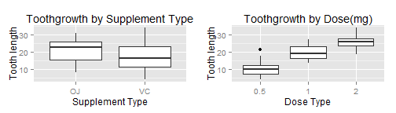

<style type="text/css">
body, td {
   font-size: 12px;
}
code.r{
  font-size: 8px;
}
pre {
  font-size: 8px;  
}
pre code {
  font-size: 8px;
}
code {
  font-size: 8px;
}
</style>

##"ToothGrowth Data Analysis"
###1. Load the ToothGrowth data and perform some basic exploratory data analyses

```r
library(reshape2); library(stats); library(ggplot2); library(gridExtra)
data(ToothGrowth); dTG = ToothGrowth
dTG$dose = as.factor(dTG$dose); dTG$supp = as.factor(dTG$supp)
```

###2. Provide a basic summary of the data.

####Exploratory Analysis and Basic Summary of Data

```r
summary(dTG)
p <- ggplot(dTG, aes(supp, len)) + ggtitle ("Toothgrowth by Supplement Type") + xlab("Supplement Type") + ylab("Tooth length") + geom_boxplot()
q <- ggplot(dTG, aes(dose, len)) + ggtitle ("Toothgrowth by Dose(mg)") + xlab("Dose Type") + ylab("Tooth length") + geom_boxplot()
grid.arrange(p, q, ncol=2)
```

```
##       len       supp     dose   
##  Min.   : 4.2   OJ:30   0.5:20  
##  1st Qu.:13.1   VC:30   1  :20  
##  Median :19.2           2  :20  
##  Mean   :18.8                   
##  3rd Qu.:25.3                   
##  Max.   :33.9
```

 

###3. Use confidence intervals and hypothesis tests to compare tooth growth by supp and dose

####Ttest comparing tooth growth by Supp

```r
t.test(len ~ supp, paired = FALSE, var.equal = FALSE, data = dTG)
```

```
## 
## 	Welch Two Sample t-test
## 
## data:  len by supp
## t = 1.915, df = 55.31, p-value = 0.06063
## alternative hypothesis: true difference in means is not equal to 0
## 95 percent confidence interval:
##  -0.171  7.571
## sample estimates:
## mean in group OJ mean in group VC 
##            20.66            16.96
```

####Ttest comparing tooth growth by Dose

#####Comparing Tooth Growth with Dose(0.5,1)

```r
dTG1 = subset(dTG, dose %in% c(0.5, 1))
t.test(len ~ dose, paired = FALSE, var.equal = FALSE, data = dTG1)
```

```
## 
## 	Welch Two Sample t-test
## 
## data:  len by dose
## t = -6.477, df = 37.99, p-value = 1.268e-07
## alternative hypothesis: true difference in means is not equal to 0
## 95 percent confidence interval:
##  -11.984  -6.276
## sample estimates:
## mean in group 0.5   mean in group 1 
##             10.61             19.73
```

#####Comparing Tooth Growth with Dose(0.5,2)

```r
dTG2 = subset(dTG, dose %in% c(0.5, 2))
t.test(len ~ dose, paired = FALSE, var.equal = FALSE, data = dTG2)
```

```
## 
## 	Welch Two Sample t-test
## 
## data:  len by dose
## t = -11.8, df = 36.88, p-value = 4.398e-14
## alternative hypothesis: true difference in means is not equal to 0
## 95 percent confidence interval:
##  -18.16 -12.83
## sample estimates:
## mean in group 0.5   mean in group 2 
##             10.61             26.10
```

#####Comparing Tooth Growth with Dose(1,2)

```r
dTG3 = subset(dTG, dose %in% c(1, 2))
t.test(len ~ dose, paired = FALSE, var.equal = FALSE, data = dTG3)
```

```
## 
## 	Welch Two Sample t-test
## 
## data:  len by dose
## t = -4.901, df = 37.1, p-value = 1.906e-05
## alternative hypothesis: true difference in means is not equal to 0
## 95 percent confidence interval:
##  -8.996 -3.734
## sample estimates:
## mean in group 1 mean in group 2 
##           19.73           26.10
```
###4. State your conclusions and the assumptions needed for your conclusions.

The tests assume that there are 10 guinea pigs in each of the 2X3 treatment conditions. So compared as independent groups. Data is assumed to be iid normal.Due to lack of information, variance is assumed to be unequal. From the Supplement Ttest, the true difference in means is not equal. From the confidence interval on pairwise comparison of dose, none of it includes 0, indicating the mean of group 0.5 is less than the mean of group 1, which in turn is less than the mean of group 2.
